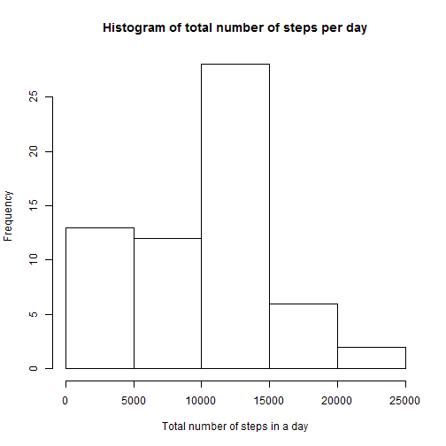
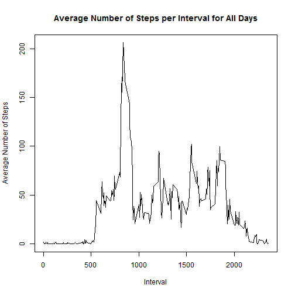
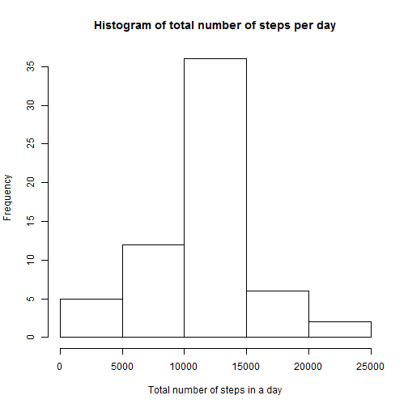
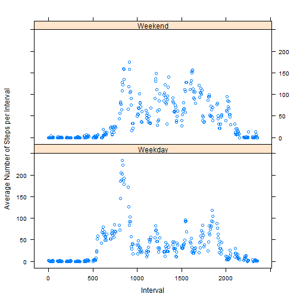

**Loading and preprocessing the data**

```r
library(dplyr)
```

```
## Warning: package 'dplyr' was built under R version 3.1.3
```

```
## 
## Attaching package: 'dplyr'
## 
## The following objects are masked from 'package:stats':
## 
##     filter, lag
## 
## The following objects are masked from 'package:base':
## 
##     intersect, setdiff, setequal, union
```

```r
##Load data, unzip, and read into a dataframe
setwd("C:/Users/Garth/Documents/R/ReproducibleResearch/Commit2")
data <- read.csv("activity.csv")
```
**What is mean total number of steps taken per day?**

```r
##Calculate the total number of steps taken per day
stepsPerDay <- data %>% group_by(date) %>% summarise(dailySteps = sum(steps, na.rm = TRUE))

##Make a histogram of the total number of steps taken each day
hist(stepsPerDay$dailySteps, main="Histogram of total number of steps per day", xlab="Total number of steps in a day")
```

 

```r
##Calculate and report the mean and median of the total number of steps taken per day
meanSteps <- as.integer(mean(stepsPerDay$dailySteps))
medianSteps <- as.integer(median(stepsPerDay$dailySteps))
```
- The mean number of steps per day is: 9354  
  
- The median number of steps per day is: 10395 
  
**What is the average daily activity pattern?**

```r
##Make a time series plot of the 5-minute interval & the average number of steps taken, averaged across all days
aveStepsPerInterval <- data %>% group_by(interval) %>% summarise(aveSteps = mean(steps, na.rm = TRUE))
plot(aveStepsPerInterval$interval, aveStepsPerInterval$aveSteps, type = "l", main="Average Number of Steps per Interval for All Days", xlab="Interval", ylab="Average Number of Steps")
```

 

```r
##Which 5-minute interval, on average across all the days in the dataset, contains the maximum number of steps?
maxInterval <- filter(aveStepsPerInterval, aveSteps == max(aveStepsPerInterval$aveSteps))
```
- The 5-minute interval with maximum average number of steps: 835 (206 Steps)

**Imputing missing values**

```r
##Calculate and report the total number of missing values in the dataset (i.e. the total number of rows with NAs)
nas <- sum(is.na(data$steps))
```
- The total number of missing values: 2304  


```r
##Devise a strategy for filling in all of the missing values in the dataset
      ##My Strategy: Fill in mean value for that interval
##Create a new dataset that is equal to the original dataset but with the missing data filled in
fillData <- merge(data, aveStepsPerInterval, by = "interval")
fillData$stepsFill <- ifelse(is.na(fillData$steps), fillData$aveSteps, fillData$steps)

##Make a histogram of the total number of steps taken each day and Calculate and report the mean and median total number of steps taken per day.
stepsPerDayFill <- fillData %>% group_by(date) %>% summarise(dailyStepsFill = sum(stepsFill, na.rm = TRUE))

hist(stepsPerDayFill$dailyStepsFill, main="Histogram of total number of steps per day", xlab="Total number of steps in a day")
```

 

```r
meanStepsFill <- as.integer(mean(stepsPerDayFill$dailyStepsFill))
medianStepsFill <- as.integer(median(stepsPerDayFill$dailyStepsFill))

meanPct <- as.integer(abs((meanSteps - meanStepsFill)/(meanSteps))*100)
medianPct <- as.integer(abs((medianSteps - medianStepsFill)/(medianSteps))*100)
```
- The mean number of steps per day with substitution is: 10766 (15% different from no substitution) 
  
- The median number of steps per day with substitution is: 10766 (3% different from no substitution)  
  
**Are there differences in activity patterns between weekdays and weekends?**


```r
##Create a new factor variable in the dataset with two levels "weekday" and "weekend"
data$weekDay <- weekdays(as.Date(data$date))
data$dayCat <- ifelse(data$weekDay %in% c("Saturday", "Sunday"), "Weekend", "Weekday")
aveStepsPerIntervalCat <- data %>% group_by(interval, dayCat) %>% summarise(aveSteps = mean(steps, na.rm = TRUE))

##Make a panel plot containing a time series plot of the 5-minute interval and the average number of steps taken, averaged across all weekday days or weekend days.
library(lattice)
xyplot(aveSteps ~ interval | dayCat, data = aveStepsPerIntervalCat, layout = c(1, 2), xlab = "Interval", ylab = "Average Number of Steps per Interval")
```

 
